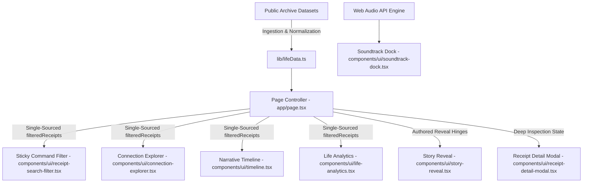

# System Architecture & Technical Design

This document details the architectural principles, component hierarchy, data flow, and design patterns underpinning **WAKE**.

## 1. Unidirectional Data Architecture
The application adheres strictly to unidirectional data flow:
- **Global Filter State**: Lifted exclusively to `app/page.tsx` (`searchQuery`, `selectedTypes`, `selectedChapter`).
- **Single-Source of Truth**: All downstream components (`Timeline`, `ConnectionExplorer`, `LifeAnalytics`, `ReceiptSearchFilter`) consume the derived `filteredReceipts` array passed down via props.
- **Zero Redundant State**: Components are forbidden from keeping localized copies of receipt datasets.

## 2. Component Hierarchy
- **`app/layout.tsx`**: Root HTML shell, font declarations, dark theme configuration, and SEO metadata.
- **`app/loading.tsx`**: Streaming suspense fallback with animated pulse glow.
- **`app/error.tsx`**: Client-side error boundary catching runtime errors gracefully.
- **`app/not-found.tsx`**: Atmospheric 404 response page matching brand aesthetics.
- **`app/page.tsx`**: Orchestrator assembling the 7 core experience sections.

## 3. Tactile Multi-Format Design System
Each digital fragment is rendered using dedicated CSS micro-architectures:
- **Thermal Receipts**: Monospace font, CSS sawtooth jagged paper bottom tear, dashed receipt divider borders.
- **Vinyl Sleeves**: Circular concentric grooved gradient textures, track badge telemetry, and center label spin animations.
- **iMessage Bubbles**: Rounded asymmetrical speech bubbles with drop shadows and status indicators.
- **Legal Pad**: Goldenrod ruled lines and perforated header strips.
- **Polaroid Photos**: Heavy white framing with bottom margin caption area and subtle analog tilt.

## 4. Pure SVG Vector Mathematics
- **Connection Lines**: Dynamically calculates cubic Bezier control points `(M x1 y1 C cx1 cy1, cx2 cy2, x2 y2)` between card center coordinates in the Constellation view.
- **Life Analytics Charts**: Calculates SVG circle `strokeDasharray` and `strokeDashoffset` dynamically with `-rotate-90` transform for zero-dependency 60 FPS donut charts.

## 5. Performance Optimizations
- **Turbopack Compilation**: High-speed Next.js incremental compilation.
- **Sub-200ms Debouncing**: Prevents filter jank on high-frequency keystrokes.
- **Tailwind CSS v4 JIT**: Zero deprecated utility classes with hardware-accelerated CSS transforms.
